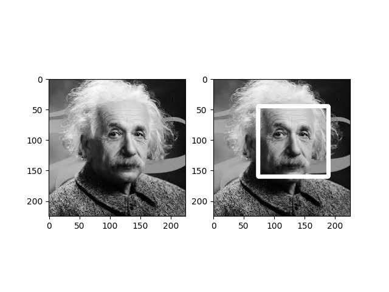
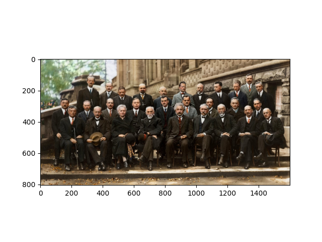
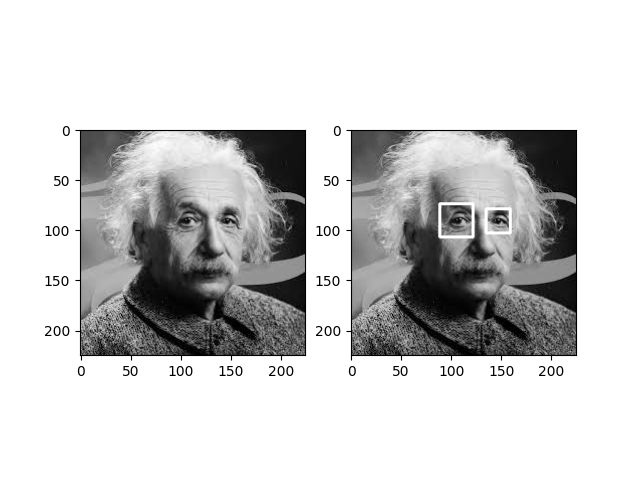
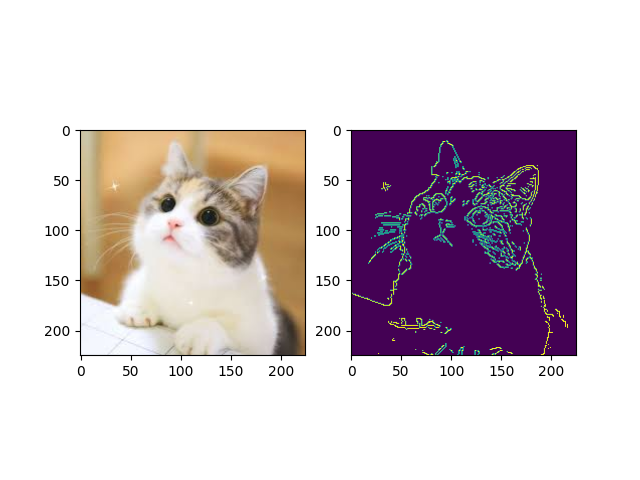
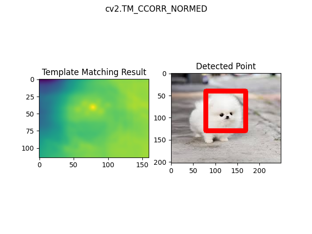

# Ira

### Real-time keypoint detection library for face, eyes, and edge estimation

<br>

## Overview
Ira is a free and open-source real-time keypoint detection library based on [OpenCV](https://github.com/opencv/opencv) written in the Python programming language. It allows the development of keypoint detection applications for face, eyes, edge estimation, and more!

<br>

## Getting Started
#### 1. Fork Ira and clone the repository:
  ```
  * git clone git://github.com/ak811/ira.git
  ```
#### 2. Import the project via any Python IDEs:
  * Install [OpenCV](https://github.com/opencv/opencv):
  ``` 
  pip install opencv-python
  ```
  * Install [Matplotlib](https://github.com/matplotlib/matplotlib):
  ```
  pip install matplotlib
  ```
  * Install [NumPy](https://github.com/numpy/numpy):
  ```
  pip install numpy
  ```  
#### 3. You're ready to go!
  ```
  * The documentations will be provided soon.
  ```
  
<!-- View Documentation -->

<br>

## How it is real-time?
#### Use the following function in every python class you want to use detection methods. It will open your device's webcam and detect the keypoints you mentioned in the function.
 ~~~python
def live_detection_by_camera():
    cap = cv2.VideoCapture(0)

    while True:

        ret, frame = cap.read(0)

        frame = detect_face(frame)

        cv2.imshow('Video Face Detection', frame)

        c = cv2.waitKey(1)
        # Esc key
        if c == 27:
            break

    cap.release()
    cv2.destroyAllWindows()
  ~~~

<br>

## Face Detection

<br>


<br>
<br>

## Eye Detection

<br>
<br>

## Edge Detection

<br>
<br>

## Template Maching

<br>
<br>
